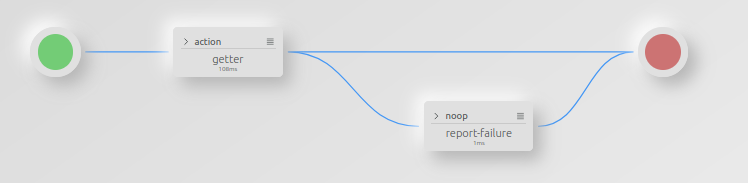
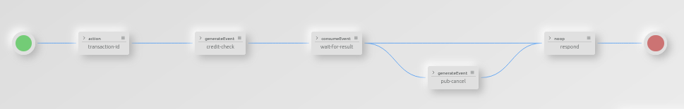
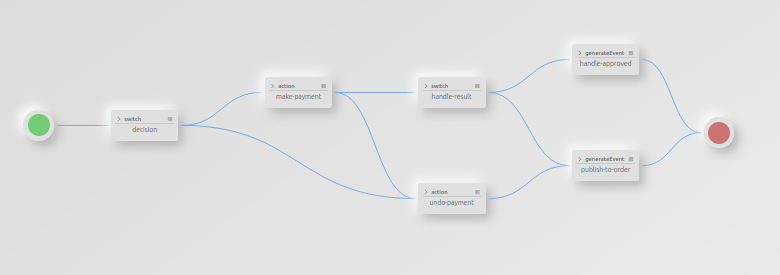

## Saga distributed transactions in Direktiv

The Saga pattern is a popular design pattern in the microservice world. It addresses the
problem of transactions in distributed systems. This blog post is not going to explain the Saga pattern in detail because there are already excellent [explanations](https://microservices.io/patterns/data/saga.html) and [examples](https://docs.microsoft.com/en-us/azure/architecture/reference-architectures/saga/saga) out there. Instead it will show how to implement it in [Direktiv](https://github.com/vorteil/direktiv), a knative-based orchestration and aggregation engine.

### The problem

Transactions are a well know concept used in databases for decades. They are a unit of work containing one more commands and only getting completed as a unit a.k.a. all or nothing. This ensures data integrity and validity in a database (Atomicity, Consistency, Isolation, Durability).

In the microservice age backend services are adopting the *database-per-microservice* pattern to achieve independence from other services. This approach requires a strategy to handle business transaction across multiple microservices to provide a rollback/commmit mechanism for overarching services to provide data integrity comparable to a database two-phase commit.   

There are two Saga concepts to achieve that goal:

- Choreography: Collaboration via events
- Orchestration: Collaboration via centralized orchestrator

### Difference between service and a Direktiv flow

*The question is: How can we implement this pattern in Direktiv?*

It is important to understand the difference between a service and a Direktiv flow. Direktiv is an orchestration and aggregation engine which manages the containers involved in a flow as well as the flow itself. A flow can include multiple functions, which is the equivalent for services and provides conditional statements, error handling and retries around those. A flow can basically act as orchestrator for one or multiple services.

The following example shows a simple backend service call in direktiv. It includes one function, a retry definition and error handling. In a choreography saga this will be unit size of a Direktiv flow: One function plus exception handling. In this way the individual steps in the Saga can exchange events and can react on incoming events.



<p/>
<details>
  <summary>Direktiv workflow yaml source (click)</summary>
  <p>

  ```yaml
  id: example
  functions:
    - id: get
      type: reusable
      image: vorteil/request:v11
  states:
    - id: getter
      type: action
      action:
        function: get
        input:
          method: GET
          url: https://my-backend-service
        retries:
          max_attempts: 3
      catch:
      - error: "*"
        transition: report-failure
    - id: report-failure
      type: noop
      log: 'error in function: jq(.error.msg)'
  ```
  </p>
</details>
<p/>

### Structure for choreography 

In a choreography there a two different types of Direktiv flows involved. One to handle the inital request and start the actual workflow or Saga. We call it  "initiator". The main purpose for the initiator is to provide an API to start, validate and respond to the request. It has a different design than the subsequent participants in the workflow. The initiator should include up to four states:

*Overview of an initiator flow*


<p/>

**Validation state (Optional):**

The validation state use [JSON schema](https://docs.direktiv.io/docs/specification.html#schemadefinition) to validate the incoming JSON into the service. It is not mandatory but recommended. A validator saves boilerplate JSON checking in all flows and functions in the specific workflow. If the data does not pass the service responds with either an error or it can transition into the reponse state and return a standardized error to the requestor. 

**Publish event state:**

The second state is to kick off the Saga with an event with a *generateEvent* state. This state publishes a [cloudevents](https://cloudevents.io/) to Direktiv's event bus. In the following yaml there is an additional extension context attributes called "transaction" attached to the cloudevent. This is used to identify the transaction across multiple workflow participants. It is not required to attach an unique identifer as context. It can be part of the data payload as well as well as long an unique identifier exists. 
```yaml
  - id: publish-payment-event
    type: generateEvent
    event:
      type: io.direktiv.order.placed
      source: /direktiv/order
      context:
        transaction: 'jq(.transaction)'
      data:
        details: 'jq(.)'
```

If no unique identifier exists in the incoming data an additional step can be added to generate a transaction id after the validaton state. Direktiv provides apassword function which can be used for this purpose.

```yaml
  - id: transaction-id
    type: action
    action:
      function: genid
      input:
        length: 10
    transition: credit-check
  ```

**Awaiting state:**

This step is the most important one in a choreography based Saga in Direktiv. It waits for an event coming back from the subsequent services triggered by the event in the publish state. Although there is a default 15 minute timeout attached to every state it is recommended to add a more workflow specific timeout to this state to provide early feedback in case of failures or errors.


```yaml
  - id: wait-for-result
    type: consumeEvent
    #  ISO-8601 timeout
    timeout: PT5S
    event:
      type: io.direktiv.order.result
      # provide transaction id
      context:
        transaction: 'jq(.transaction)'
    log: 'waiting for transaction: jq(.transaction)'
    transition: respond
    catch:
    - error: "direktiv.cancels.timeout"
      transition: pub-cancel
```

In case of a timeout participating flows need to be informed of the cancel event to avoid data inconsitencies. In the above example the timeout is caught as an error and it transitions to a *pub-cancel* state which can publish a cancel event to the participating flows. 

**Response State (Optional):** 

Direktiv is at its core a state machine. Therefore the default response for a flow is the last state data of the finished flow. Sometimes it is required to delete, add or modify JSON data for the response of the request. This can be achieved with a simple *noop* state at the end of the flow. The transform attribute uses [JQ](https://stedolan.github.io/jq/) to change the return value of the flow. 

```yaml
  - id: respond
    type: noop
    log: jq(.)
    transform: 'del(.transaction)'
```

### Layout workflow participants

The particpants in a worklfow need to provide a transaction and a a compensating transaction in case of an error or cancel. These two transaction can be combined in one Direktiv flow or in two seperate flows. Because it is easier to manage fewer flows it is recommended to use one flow for this participants.

*Overview of an participating flow*



Participants are listening up to three events:

- Transaction event: Executing the actual transaction
- Cancel event: Cancel event in case of a global timeout
- Compensating event: Compensating called from next flow

These events are defined in the start definition of a Direktiv flow:

```yaml
start:
  type: eventsXor
  events:
    - type: io.direktiv.order.placed
    - type: io.direktiv.payment.undo      
    - type: io.direktiv.order.undo
```

Although cancel events and compensating events are different event types in this case, they calling the same function to rollback the transaction. In the above example *undo-payment*. To handle technical errors e.g. backend connectivity issues the function call uses retries and error handling to avoid inconsistent states. The following example does exactly this ubt it is important to transition to the *undo-payment* state as well in case of an error to rollback an ongoing transaction.

```yaml
  - id: make-payment
    type: action
    action: 
      function: fn
      input: 'jq(.)'
      retries:
        max_attempts: 3
        codes: [".*"]
    catch:
    - error: "*"
      transition: undo-payment
    transition: handle-result
```

To handle all of the states correctly the function (service) implementation needs to be:

**[Idempotent](https://en.wikipedia.org/wiki/Idempotence):**

In case of retries the service is getting called multiple times with the same data. The service needs to handle duplicated calls correctly. In general the data going into the service need some unique identifier. In this example the transaciton id could be used to identify duplicate requests. 

**[Commutative](https://en.wikipedia.org/wiki/Commutative_property):**

In this payment example the cancel command can potentially hit the service before the *make-payment* service is getting executed. The function/service needs to handle those situations correctly. 

After calling the function the flow needs to assess the return value of the function. In Direktiv this is usually JSON and a switch state will route the flow to a success or failure state.

```yaml
 - id: handle-result
    type: switch
    conditions:
    - condition: 'jq(.return.result == false)'
      transition: handle-declined
    defaultTransition: handle-approved
```

For both outcomes events need to be published to either rollback previous local transactions or proceed with the workflow. It is important to make sure that the last event in the choreography is publishing an event for the inititator, in our case a *io.direktiv.order.result* event. As soon as an event of that type is in DIrektiv's event bus the initiator returns the response to the requestor. 

### Transactional outbox

In many posts about the Saga pattern the [transactional outbox](https://microservices.io/patterns/data/transactional-outbox.html) is recommended to make sure the database or service update is reliable or atomic. This pattern make sure an event is published reliably if the local transaction had been executed. 

Direktiv addresses this issue with an at-least once delivery of events and with the fact that Direktiv is a database-backed state machine. Although the function call and event publishing happens in two different states, Direktiv ensures the execution of both states. In case of  for example server crashes or network issues Direktiv recovers from the last step in the flow. This makes sure events are always getting published. 

### Conclusion

The choreography pattern is an easy to use pattern for distributed transactions. Although Direktiv is removing parts of the complexity with externalizing error handling and event publishing the complexity increases with a growing number of participants. Because Direktiv use mini-orchestrators for each service in the choreography already it makes more sense to implement a orchestration Saga with Direktiv and this will be the topic of a future blog post.
